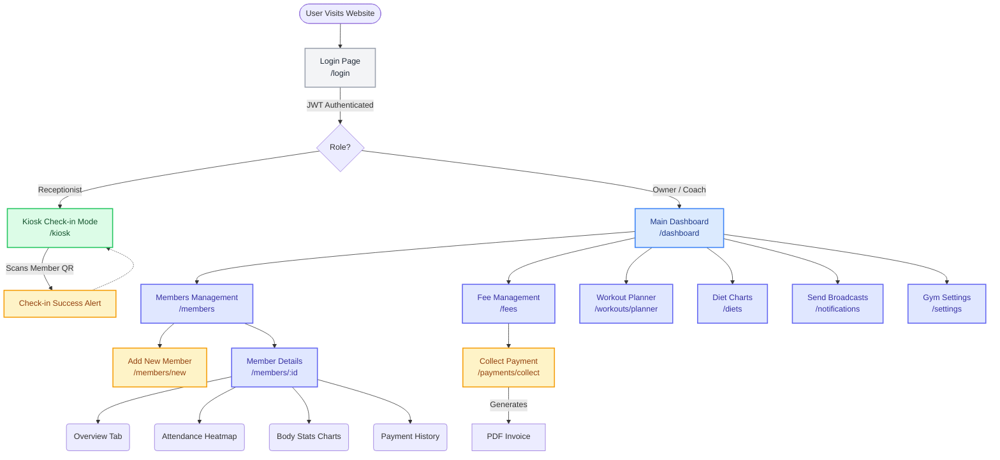
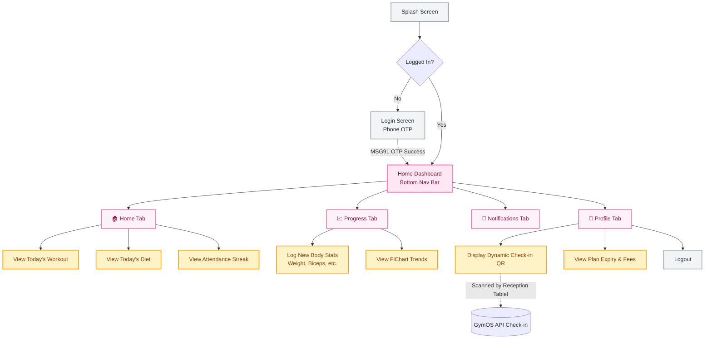

# GymOS Screen Flow & Navigation Architecture

This document maps out the user journey and screen connections for both the **Web Admin Panel** and the **Member Mobile App**. 

*(GitHub natively renders these Mermaid diagrams. Just view this file on GitHub to see the visual flowcharts!)*

## 1. Web App (Admin Panel & Kiosk)
**Audience:** Gym Owners, Receptionists, Coaches

---

## 2. Flutter Mobile App
**Audience:** Gym Members

