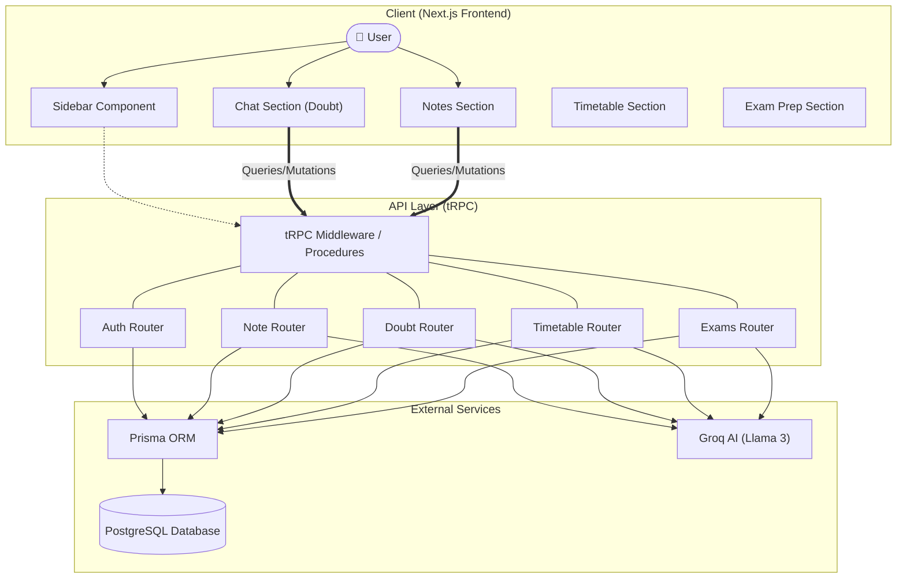

# 🏗️ StudyBot System Architecture

This UML diagram illustrates the flow of data and the relationship between the core components of the StudyBot platform.

### 🧱 Key Component Roles:
1.  **Next.js Frontend**: Handles the rich UI, animations, and client-side state (React Query managed by tRPC).
2.  **tRPC Layer**: Provides end-to-end type safety between the frontend and the business logic.
3.  **Server Routers**: Contain the main application logic, input validation (Zod), and session checks.
4.  **Groq AI**: Powerhouse for generating summaries, answering doubts, and creating study plans.
5.  **Prisma & DB**: Persistent storage for users, notes, chat history, and schedules.
